<!--
  Profile README — LightSpace / petercheng.dev
  All section chrome is SVG for a consistent visual system.
-->

<!-- ═══════════════════ HERO ═══════════════════ -->

  <a href="https://petercheng.dev">
    
  </a>

  

  <a href="https://petercheng.dev"><strong>petercheng.dev</strong></a>
  &nbsp;·&nbsp;
  <a href="https://www.linkedin.com/in/petercheng/">LinkedIn</a>
  &nbsp;·&nbsp;
  <a href="mailto:chengzhongquan0630@gmail.com">Email</a>
  &nbsp;·&nbsp;
  <a href="https://petercheng.dev/resume.pdf">Résumé</a>

  

  

<!-- ═══════════════════ § 00 ABOUT ═══════════════════ -->

  

I build backend systems and ML pipelines at the intersection of reliable engineering and applied research: distributed request pipelines and LLM infrastructure at Undergraduation.com, sensor-based depression detection at Syracuse, and medical-imaging segmentation at WashU’s AI for Health Institute.

  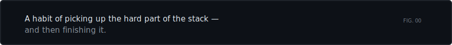

  

<!-- ═══════════════════ § 01 EXPERIENCE ═══════════════════ -->

  

  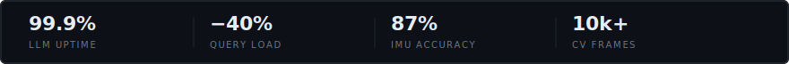

 

  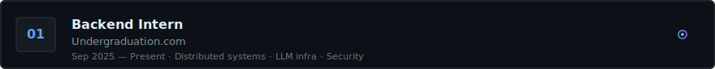

- Distributed SSE + serverless request pipeline — 50+ concurrent users, zero blocking
- Fault-tolerant LLM gateway with failover & latency-based A/B routing — **99.9%** uptime
- PostgreSQL composite-key caching — **−40%** redundant queries
- Row-Level Security + middleware — zero cross-tenant leakage on vector search

 

  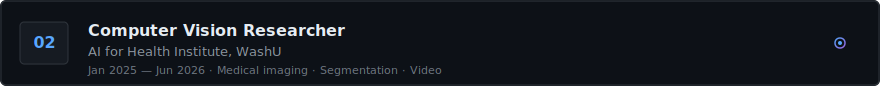

- Meta Sapien + OpenCV pipeline — segmentation masks across **10,000+** clinical frames
- FFmpeg high-speed extraction — **−60%** preprocessing latency on 50+ hrs of footage
- Dynamic exposure workflow — **+80%** human detection in low-light scenes

 

  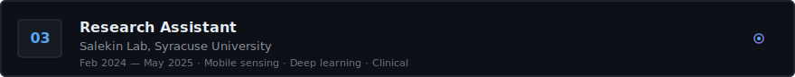

- Android multi-modal IMU collection framework (Kotlin, Factory pattern)
- Dockerized ML training — environment setup **2 hrs → 5 min**
- Hybrid CNN-LSTM on high-frequency IMU — **87%** depression-biomarker accuracy
- HIPAA-aligned data handling with clinical partners

 

  

- XGBoost sales forecasting with lag features — **92%** prediction accuracy
- Automated ETL against the data warehouse — **−40%** extraction latency
- High-dimensional transaction analysis for Shanghai-region strategy

  

<!-- ═══════════════════ § 02 SELECTED WORK ═══════════════════ -->

  

  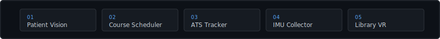

| # | Project | Stack |
|:-:|:---|:---|
| `01` | **[Patient-Monitoring Vision Pipeline](https://petercheng.dev/projects/patient-vision)** — overhead clinical video, sequence-error detection | Python · PyTorch · Meta Sapien · OpenCV · FFmpeg |
| `02` | **[Engineering Course Scheduler](https://petercheng.dev/projects/course-scheduler)** — prereq-aware, conflict-free timetables | React · Node.js · AWS |
| `03` | **[ATS — Application Tracker](https://petercheng.dev/projects/application-tracker)** — Gmail ingestion + AI triage · *2nd place, Syracuse Tech Challenge* | React · Node · PostgreSQL · Gmail API |
| `04` | **[IMU Depression-Signal Collector](https://petercheng.dev/projects/imu-collector)** — scheduled multi-modal sensing for Salekin Lab | Android · Kotlin · Signal Processing |
| `05` | **[Library VR](https://petercheng.dev/projects/library-vr)** — gesture-driven campus library onboarding | Unity · C# · VR |

  

<!-- ═══════════════════ § 03 STUDIES & STACK ═══════════════════ -->

  

  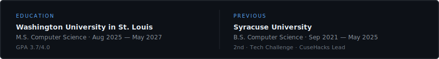

 

  

  

<!-- ═══════════════════ § 04 ELSEWHERE ═══════════════════ -->

  

  <a href="https://petercheng.dev"><strong>petercheng.dev</strong></a>
  &nbsp;·&nbsp;
  <a href="https://github.com/peterCheng123321">GitHub</a>
  &nbsp;·&nbsp;
  <a href="https://www.linkedin.com/in/petercheng/">LinkedIn</a>
  &nbsp;·&nbsp;
  <a href="mailto:chengzhongquan0630@gmail.com">Email</a>
  &nbsp;·&nbsp;
  <a href="https://petercheng.dev/resume.pdf">Résumé</a>

  <a href="https://petercheng.dev">
    
  </a>

