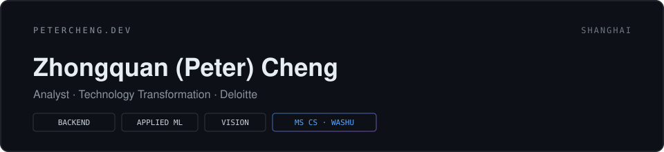

<!-- Profile README — https://petercheng.dev -->

  

  <a href="https://petercheng.dev"><b>petercheng.dev</b></a>
  &nbsp;·&nbsp;
  <a href="https://www.linkedin.com/in/zhongquan-cheng/">LinkedIn</a>
  &nbsp;·&nbsp;
  <a href="mailto:chengzhongquan0630@gmail.com">Email</a>
  &nbsp;·&nbsp;
  <a href="https://petercheng.dev/resume.pdf">Resume</a>

---

### About

Incoming **Analyst 1 · Technology Transformation** at **Deloitte** (Shanghai).  
M.S. Computer Science at **Washington University in St. Louis**. Building at the intersection of reliable backends, applied ML, and computer vision — and shipping it through [**PeterOS**](https://petercheng.dev) on the site.

| | |
|:---|:---|
| **Now** | Incoming Analyst @ Deloitte · Shanghai |
| **Study** | M.S. CS, WashU (Aug 2025 – May 2027) |
| **Before** | Backend @ Undergraduation.com · CV research @ WashU AI for Health · Syracuse B.S. CS |
| **Focus** | Backend systems · Applied ML · Computer vision |

---

### Experience

**Deloitte** — Analyst 1 · Technology Transformation  
`Shanghai · Incoming full-time (Aug 2026)`

- Technology-enabled change and modern systems delivery for clients  
- Bringing backend engineering, applied ML, and research into consulting  

**Undergraduation.com** — Backend Engineering Intern  
`2025 – 2026`

- Distributed SSE + serverless request pipeline (50+ concurrent users)  
- Fault-tolerant LLM gateway with failover / A/B routing — **99.9%** uptime  
- PostgreSQL caching (**-40%** redundant queries) + row-level security  

**AI for Health Institute, WashU** — Graduate Researcher (CV)  
`2025 – 2026`

- Meta Sapien + OpenCV segmentation across **10,000+** clinical frames  
- FFmpeg pipeline — **-60%** preprocessing latency  
- Low-light exposure workflow — **+80%** human detection  

**Salekin Lab, Syracuse** — Research Assistant  
`2024 – 2025`

- Android multi-modal IMU collection (Kotlin)  
- Hybrid CNN-LSTM on sensor streams — **87%** depression-biomarker accuracy  
- Dockerized training (setup **2 hrs → 5 min**) · HIPAA-aligned handling  

**Asia Pulp & Paper** — Data Science Intern  
`2023`

- XGBoost sales forecasting — **92%** accuracy  
- Warehouse ETL — **-40%** extraction latency  

---

### Selected work

| Project | Stack |
|:---|:---|
| [**Patient-Monitoring Vision Pipeline**](https://petercheng.dev) — clinical video segmentation | Python · PyTorch · OpenCV · FFmpeg |
| [**Engineering Course Scheduler**](https://petercheng.dev) — prereq-aware timetables | React · Node · AWS |
| [**ATS — Application Tracker**](https://petercheng.dev) — Gmail + AI triage · *2nd, Syracuse Tech Challenge* | React · Node · PostgreSQL |
| [**IMU Depression-Signal Collector**](https://github.com/peterCheng123321) — multi-modal sensing | Android · Kotlin |
| [**Library VR**](https://github.com/peterCheng123321) — gesture-driven onboarding | Unity · C# |

---

### Stack

`Python` `TypeScript` `Java` `C/C++` `SQL`  
`PyTorch` `scikit-learn` `XGBoost` `OpenCV` `LLM orchestration`  
`Node` `React` `Next.js` `PostgreSQL` `Redis` `AWS` `Docker`  
`Android` `Unity`

---

### Education

- **Washington University in St. Louis** — M.S. Computer Science · 2025–2027  
- **Syracuse University** — B.S. Computer Science · 2021–2025  
  - 2nd Place · Syracuse Tech Challenge (AI for Mental Health)  
  - Senior Workshop Lead · CuseHacks  

---

  
    <a href="https://petercheng.dev">petercheng.dev</a>
    · Shanghai · WashU · Deloitte
  

